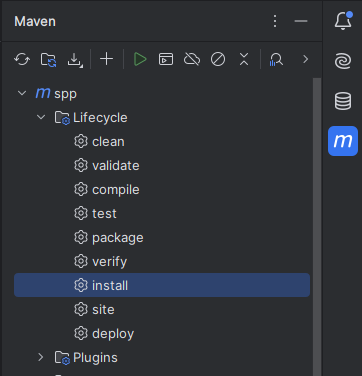
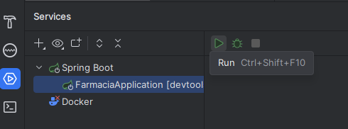

# ✚ MedMais: Sistema de Gerenciamento de Farmácia

## Descrição

Este projeto tem como objetivo desenvolver um software de gerenciamento de uma farmácia, com o intuito de facilitar a gestão de estoque, como entrada e saída de medicações, vendas, prescrições médicas, controle de validade de medicamentos e facilitar a comunicação com clientes.

Sistema criado durante a disciplina de Engenharia de Software, ministrada pelo Prof. Euler Horta Marinho, na Universidade Federal de Ouro Preto (UFOP).

## Sumário

1. [Funcionalidades do Produto](#funcionalidades-do-produto)
2. [Backlog do Produto](#backlog-do-produto)
3. [Backlog da Sprint](#backlog-do-produto)
4. [Membros e Funções](#membros-e-funções)
5. [Dependências](#dependências)

## Funcionalidades do Produto

- *Gestão de Estoque*

  **História:** Como usuário, eu desejo gerenciar as movimentações do estoque da famárcia no sistema , para que eu possa cadastrar, atualizar e deletar os medicamentos e produtos farmacêuticos.
**Operações CRUD:** Criar, Ler, Atualizar, Excluir os medicamentos.
**Critérios de Aceitação:**
1. O farmacêutico deve cadastrar medicamentos e produtos farmacêuticos novos (medicamento, quantidade, lote, vencimento, tipo).
2. O farmacêutico deve atualizar a situação dos medicamentos e produtos farmacêuticos no estoque ().
3. O farmacêutico deve excluir medicamentos e produtos farmacêuticos.
4. O farmacêutico deve visualizar o controle de estoque da farmácia.
5. O sistema deve garantir que todos os dados sejam gerenciados de forma restrita, exigindo autenticação por senha.

- *Gestão de Vendas*
1. O farmacêutico deve 


## Backlog do Produto

## Backlog Sprint

## Membros e Funções
1. Richardy Rodrigues Tanure - Backend, Banco de Dados
2. Pedro Alves de Paula - Backend, Banco de Dados
3. Vitor Angelo dos Santos - Frontend
4. Danielly Mariana Martins Fragoso - Frontend
5. Kemelly Steisse da Silva - Frontend
6. Lucas Amaral Leme - Backend

## Dependências
- Docker e Docker Compose 
- Node
- Maven
- Java Development Kit (JDK 21)

## Como Rodar o Projeto

## Clonando o Repositório

``` bash
git clone https://github.com/rTanure/eng-software-gestor-farmacia.git
```

## Preparando o Ambiente
### 1. Back-end
- Iniciar container docker com o banco de dados
```
# No diretório pai
docker-compose up -d
```
- Criar conta na JetBrains com o email institucional da UFOP
- Instalar o IntelliJ IDEA
- Abrir o diretório ./api como projeto no IntelliJ
- Instalar as dependências
  


- Iniciar a aplicação
  


  - Caso não apareça o serviço, clique no "+" logo abaixo de "Services" e clique em: Run Configuration Type -> Spring Boot.
